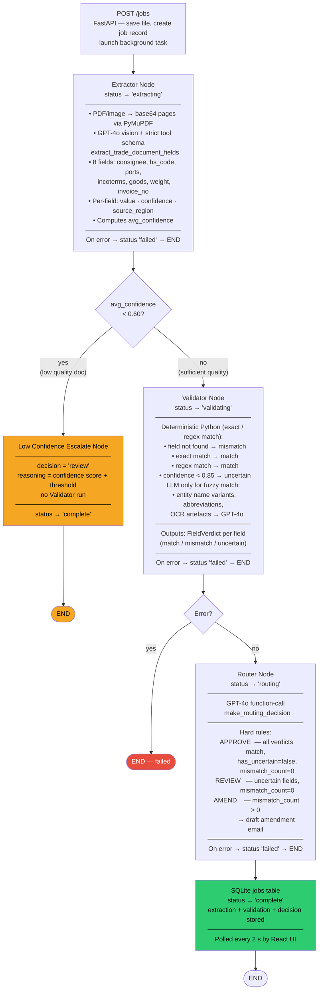

# Nova Trade Pipeline — POC

**GoComet · Multi-Agent Trade Document Processing**

Three AI agents (Extractor → Validator → Router) wired by LangGraph, served by FastAPI, displayed in React.

---

## Quick Start

### 1. Clone & configure

```bash
cd backend
cp .env.example .env
# Edit .env — set AZURE_OPENAI_ENDPOINT + AZURE_OPENAI_API_KEY
# (or OPENAI_API_KEY for standard OpenAI)
```

### 2. Backend

```bash
cd backend
python -m venv .venv
# Windows:
.venv\Scripts\activate
# macOS/Linux:
source .venv/bin/activate

pip install -r requirements.txt
uvicorn src.api.main:app --reload --port 8000
```

API docs: http://localhost:8000/docs

### 3. Frontend

```bash
cd frontend
npm install
npm run dev
```

UI: http://localhost:5173

### 4. Run tests

```bash
cd backend
pytest -v
```

---

## Architecture



## Agent Responsibilities

| Agent | Model | Input | Output | Hard Constraint |
|---|---|---|---|---|
| Extractor | GPT-4o | File + doc type hint | ExtractionResult (8 fields + confidence) | Absent field → null/0.0, no guessing |
| Validator | GPT-4o | ExtractionResult + CustomerRuleSet | ValidationResult (match/mismatch/uncertain per field) | No raw doc access; LLM only for fuzzy match, rest is Python |
| Router | GPT-4o | ValidationResult + rules | RouterDecision (approve/review/amend + reasoning) | Cannot approve with uncertain or mismatched fields |

## Confidence Thresholds

| Range | Behaviour |
|---|---|
| ≥ 0.85 | Field passes normally, eligible for auto-approve |
| 0.60 – 0.84 | Passes as `uncertain` → mandatory human review |
| < 0.60 (field) | Marked `uncertain` before reaching comparison |
| avg < 0.60 (doc) | Entire doc escalated before Validator runs |

## Environment Variables

| Variable | Required | Default | Description |
|---|---|---|---|
| `AZURE_OPENAI_ENDPOINT` | If using Azure | `https://yourresource.openai.azure.com/` | Azure OpenAI endpoint |
| `AZURE_OPENAI_API_KEY` | If using Azure | — | Azure OpenAI API key |
| `AZURE_OPENAI_API_VERSION` | If using Azure | `2024-12-01-preview` | Azure API version |
| `AZURE_OPENAI_DEPLOYMENT` | If using Azure | `gpt-4o` | Azure deployment name |
| `OPENAI_API_KEY` | If not Azure | `sk-...` | Standard OpenAI key (fallback) |
| `EXTRACTOR_MODEL` | No | `gpt-4o-2024-08-06` | Override extraction model |
| `VALIDATOR_MODEL` | No | `gpt-4o` | Override validation model |
| `ROUTER_MODEL` | No | `gpt-4o` | Override routing model |
| `DB_PATH` | No | `./nova_trade.db` | SQLite file path |
| `UPLOAD_DIR` | No | `./uploads` | Local file storage |
| `RULES_DIR` | No | `./configs/rules` | Customer rule JSON files |
| `CONFIDENCE_ESCALATE_THRESHOLD` | No | `0.60` | Below this avg → skip Validator |
| `CONFIDENCE_LOW_THRESHOLD` | No | `0.85` | Below this per-field → uncertain |
| `API_SECRET_KEY` | No | `dev-secret-key` | Bearer token (change in prod) |

## API Endpoints

| Method | Path | Description |
|---|---|---|
| `POST` | `/jobs` | Upload document, start pipeline |
| `GET` | `/jobs/{id}` | Poll job status + results |
| `GET` | `/jobs?customer_id=X&status=Y` | List jobs |
| `POST` | `/jobs/{id}/approve` | Operator manual approval |
| `POST` | `/query` | Natural-language query over stored data |
| `GET` | `/customers/{id}/rules` | Get customer rule set |
| `PUT` | `/customers/{id}/rules` | Upsert customer rule set |

## Adding a New Customer

Create `backend/configs/rules/{customer_id}.json` following the schema in `configs/rules/acme_imports.json`. The file is loaded at runtime — no code changes needed.

## Folder Structure

```
nova-trade-pipeline/
├── backend/
│   ├── src/
│   │   ├── agents/        extractor.py · validator.py · router.py
│   │   ├── graph/         pipeline.py  (LangGraph)
│   │   ├── schemas/       extraction · validation · routing · rules
│   │   ├── api/
│   │   │   ├── main.py
│   │   │   └── routes/    jobs · query · customers
│   │   ├── db/            connection · jobs_repo
│   │   └── config.py
│   ├── configs/rules/     acme_imports.json  (one file per customer)
│   ├── migrations/        001_create_jobs.sql
│   ├── tests/             test_extractor · test_validator · test_router
│   ├── uploads/           (created at runtime)
│   ├── requirements.txt
│   └── .env.example
├── frontend/
│   ├── src/
│   │   ├── components/    UploadPanel · ExtractionView · ValidationView
│   │   │                  DecisionPanel · QueryBox · PipelineStatus
│   │   └── App.jsx
│   └── package.json
└── README.md
```

## Sample Documents

Trade document PDFs or images must be manually uploaded via the UI. For testing without real documents, a scanned commercial invoice or Bill of Lading image works well. The extraction confidence scores will vary based on document quality.

### Sample Files

The `sample_docs/` directory contains pre-built sample documents for testing:
- **Approved Bill of Lading** — for 2 companies
- **Amended Bill of Lading** — for 2 companies

Use these files to test the pipeline without creating new documents.
